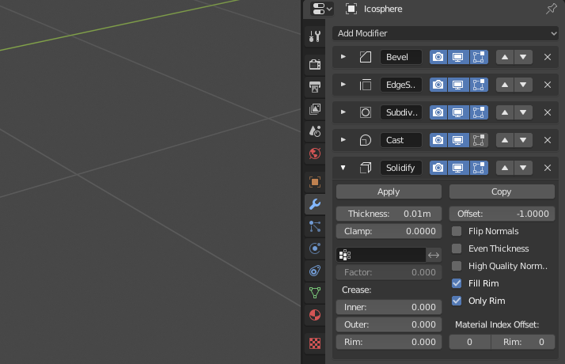
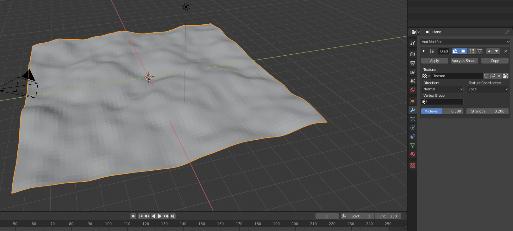

# Piłka nożna w Blenderze

Stwórzmy nowy projekt w Blenderze. Od samego początku bedziemy posługiwali się `Viewport Shading: Rendered` (prawy górny róg, lub klawisz `Z -> Rendered`).

## Projekt piłki

Skasujmy podstawowy blenderowy sześcian - zamiast tego dodajmy skrótem `Shift+A` element `Mesh -> Ico Sphere`. W lewym dolnym rogu pojawią się ustawienia `Add Ico Sphere` - otwórzmy je i zmieńmy parametr `Subdivisions` na 1 - będziemy potrzebowali naprawdę niskopolygonowy wielościan aby udało nam się odwzorować kształt piłki.

Wejdźmy w panel modyfikatorów (`Modifiers`). W pierwszej kolejności dodamy modyfikator `Bevel` (ścinanie) - da nam to kształt ściętego wielościanu, tak charakterystycznego dla piłki nożnej. Ustawmy kontrolki `Only vertices`, w `Width method` ustawmy `Percent`, a po tym parametr `Width Percent` na wartość około 35%.

Teraz materiał - wchodzimy w ustawienia materiałów (`Materials`), gdzie dodajemy dwa nowe materiały. Pierwszy z nich będzie automatycznie biały (możemy go zostawić), drugi ustawimy `Base Color` na czarny.

Teraz wróćmy do zakładki modyfikatorów. Ustawimy `Material` z wartości `-1` na `2` - bum, piłka jest czarno-biała (pod warunkiem że ustawiliśmy renderowanie na początku)! To dobry początek.

Dodajmy kolejne modyfikatory:

1. `Edge Split` i wyzerujmy kąt `Split Angle`. Pomoże nam to później zapanować nad fragmenaryzacją piłki.

2. `Subdivision Surface` i przestawmy go w tryb `Simple`. W zakładce `Subdivisions` przestawmy wartość `Viewport` na `2`.

3. `Cast` i przestawmy parametr `Factor` na wartość `1`.

4. `Solidify` z zaznaczonym parametrem `Only Rim` i wartością `Thickness` na `0.01m`.

    

5. Znowu `Bevel` - uzyskujemy dzięki temu upragniony efekt piłki zszywanej z pięcio- i sześciokątnych łat. `Width` ustawmy na `0.5m`, `Segments` na `2`, a `Profile` na `0.50`.

    

6. Ostatnie szlify - możemy teraz zatwierdzić wszystkie modyfikatory (w kolejności OD GÓRY DO DOŁU), a następnie dodać kolejny, `Multiresolution` w celu wygładzenia piłki. Kliknijmy wartość `Subdivide` dwa razy.

    

    Klikaj ostrożnie! Bezmyślne zwielokrotnianie może prowadzić do zawieszenia się programu!

    Nie zapomnijmy też o ustawieniu `Shading: Smooth` na piłce - prosta kontrolka, która bardzo efektywnie pozwala na pozbycie się widocznych wierzchołków.

Piłka gotowa! Teraz potrzebujemy trawnika.

## Projekt trawy

Stwórz nowy element, płaszczyznę (`Shift+A -> Mesh -> Plane`). Powiększ ją do odpowiednich rozmiarów, następnie w `Edit Mode` (przechodzisz tam klawiszem `Tab`) wykonaj `Subdivide` (prawy klawisz -> `Subdivide`) odpowiednią ilość razy poprzez wciśnięcie `Shift-R` (tak wiele, aż powierzchnia będzie gęsta od wierzchołków). Następnie wyjdź z `Edit Mode` i przejdź do modyfikatorów `Modifiers`.

Dodaj modyfikator `Displace` i w miejsce `Texture` dodaj nowy element. Następnie przejdź w okienko `Texture` i w `Type` dodaj element `Clouds`. Zwiększ wartość `Size` do poziomu `0.5`. Następnie wróć do zakładki `Modifiers` i ustaw `Strength` na poziom `0.2`.

# TODO

- Mamy powierzchnię - teraz kwestia samej trawy. Należy zaprojektować pęk listków tak, aby mieć faktyczną kępę trawy. Wrzucimy to w nową kolekcję (`Collection`) którą nazwiemy `Grass`.

- Dalej, wybrać `Hair` dla płaszczyzny i wymodelować realistyczną trawę.

- Ostatni kawałek - dodać tło chmur.